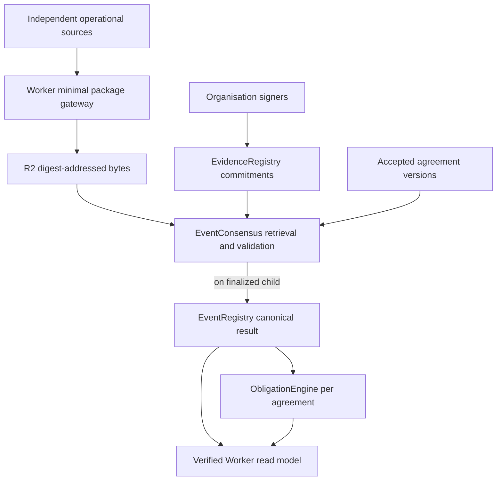
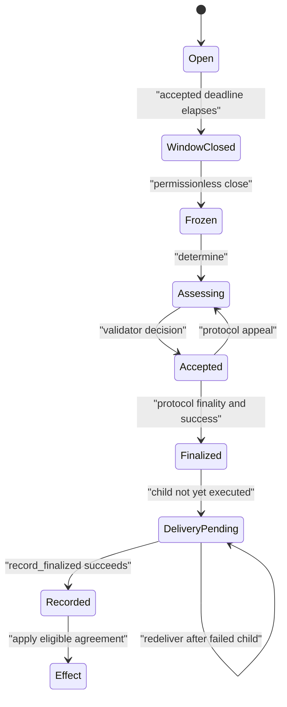

# Architecture and trust boundaries

FIELDLEDGER separates an operational fact from every agreement that consumes it. The six GenLayer contracts are the protocol source of truth. Cloudflare and Supabase may lose or misindex data without changing the determination.

| Contract | Authority and constraints |
| --- | --- |
| ParticipantRegistry | Deployer registers an organisation and one unique signer; that signer rotates itself. No verdict method. |
| AgreementRegistry | Operator proposes a sequential immutable version; named counterparty accepts. Typed policy, asset scope and clause/exclusion IDs bind interpretation and formulae. |
| EventRegistry | Any signer to an accepted event agreement may originate an event. It records the originator, party roles, type claims and agreement-scoped source authority. The shared physical envelope covers the widest accepted policy; a non-originating party can challenge the type or reported time once, within deterministic intake bounds. The bound consensus contract alone can deliver a final result. |
| EvidenceRegistry | Each authorised source signer commits event, organisation, type, observation time, target (for challenges), URL and SHA-256. Authority is scoped to the accepted agreement version. No update or delete. Packages are limited to 4 KiB/10 facts; party slots are reserved according to the number of linked parties (nine per party when there are two, down to two when there are nine); external sources share six reserved slots and have two each. Anyone can close after the onchain accepted deadline and two packages. The ordered manifest is frozen. |
| EventConsensus | Leader and validators independently retrieve exact digest-bound bytes. They check package IDs, event, organisation, type, time, challenge target, facts shape, frozen manifest, byte/fact budgets and accepted policy versions. Invalid or unavailable packages are discarded; at least two distinct usable source organisations are required before they independently assess event type, cause, responsible domain, neutral time interval and agreement-scoped clause evidence. |
| ObligationEngine | Reads only EventRegistry's finalized child result. It applies selected versioned clauses deterministically, once per event/agreement/version. UNDETERMINED blocks automatic effects. OBSERVE records analytical outcomes with no claimable credit. ENFORCE creates a DUE obligation and, for service credits, a beneficiary-initiated onchain claim. Neither claims funds were paid. |

ACCEPTED is appealable. FINALIZED and successful execution are both required for indexing a transaction. The finalized child is separately tracked. If child delivery fails, `redeliver` emits a new finalized child from the already stored consensus result; it cannot change that result. Operators should inspect and fund that transaction, then verify the child receipt.

## Evidence and confidentiality

The Worker validates a strict version 1 package, sorts JSON keys recursively, hashes the exact stored bytes, writes them to R2 under a digest key and indexes metadata. The signer independently commits the digest onchain. Validators fetch the public URL and verify the SHA-256 and every identifying field before semantic work. Challenges are full typed packages with `targetEvidenceId` and facts, not opaque hashes. A compromised database cannot substitute bytes with a different digest. Raw enterprise documents should remain in enterprise systems; the package contains only adjudication-safe facts, references, redactions and provenance. GenLayer does **not** provide confidential computation here.

Source HMAC authenticates automated uploads; Supabase Auth plus application membership authorises manual uploads. The onchain signer is a separate permission. Registration and acceptance are signed on GenLayer. External adapters are replaceable transforms for historian, CMMS, ERP, OPC-UA, OEM and lab/inspection records; their fixture samples are synthetic and no live vendor integration is claimed.

## Semantic and deterministic boundary

The consensus model assesses ambiguity: event type, policy-bounded primary cause, bounded cause class/code, contributing cause codes, responsible domain, neutral start/end, and clause/exclusion applicability. A deterministic mapping ties each policy cause to one class and an explicit set of valid codes. A primary code must match that cause; contributing codes must be unique, bounded, and drawn from the linked policies' admitted taxonomies. `UNDETERMINED` carries only its sentinel code and no contributing codes. Validators rerun evidence retrieval and semantic assessment and compare all those substantive fields and cited evidence IDs. Both outputs are checked for participant/role coherence, accepted cause taxonomy, claimed event types, per-agreement evidence authority and event-derived interval bounds. The protocol hard limit is 128 KiB and 240 facts; fixed manifest slots cap reachable evidence at 96 KiB, 240 facts, and 4 KiB/10 facts per package. Prompt text identifies source content as hostile. Model common-mode error, collusion and temporal source staleness remain risks requiring live adversarial validation.

A stale package is ignored according to the accepted policies' evidence-age limits. A selected clause must have fresh evidence of its required type within that agreement's source scope; a single malicious or unavailable third package cannot veto two valid independent sources. Integer minute duration, thresholds, availability basis points, service credits, warranty flags and JV shares are computed by the ObligationEngine within each agreement's own consequence window. No LLM computes arithmetic. The five policy metrics are `CREDIT_PER_MINUTE`, `AVAILABILITY_BPS`, `WARRANTY_FLAG`, `JV_SHARE_BPS`, `RECORD_ONLY`. `ENFORCE` records a DUE credit or obligation and supports a beneficiary-signed claim for a positive credit. `OBSERVE` cannot be claimed. Neither performs an invoice payment or GEN transfer.

## Index authority

The Worker decodes each tracked transaction and verifies recipient, method, argument, FINALIZED status and `FINISHED_WITH_RETURN`, then reads corresponding contract state. It indexes event/evidence/determination/agreement/effect records and, when available, raw receipt rounds and fee accounting. Periodic reconciliation discovers finalized children. Index failures remain visible. A decision package export reads contracts again, rechecks each included receipt, writes a digest-addressed R2 audit object and includes network, manifest, evidence commitments, determination, effects, receipts and verification time. The read model is searchable cache; chain wins any conflict.
